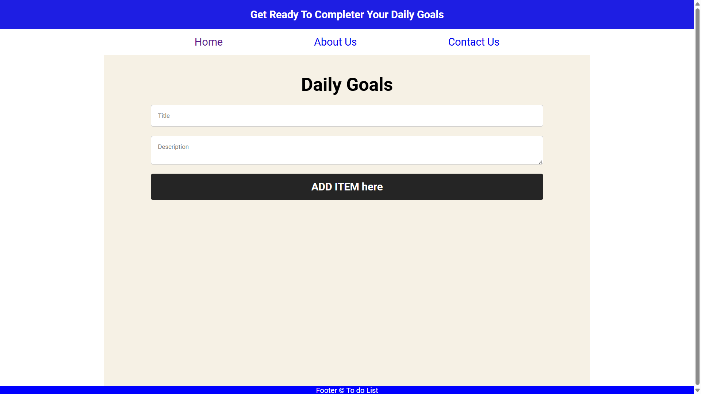

# React To-Do List App

## Overview
This is a simple To-Do List web application built using React, To-Do List app is a user-friendly tool designed to help individuals manage tasks efficiently. With features such as task creation, priority settings, task completion tracking, and filtering options, it empowers users to stay organized, focused, and productive in their daily activities..

## Features

- Add tasks to the list
- Delete tasks from the list
- Clear completed tasks
- Responsive design for mobile and desktop

## Demo

You can view a live demo of the React To-Do List app [here](https://first-git-bash-to-do-lists.vercel.app/).


## Usage

- To add a task, type the task in the input field and press Enter or click the Add button.
- To delete a task, click the delete icon next to the task.
- Click the "Clear " button to remove completed tasks from the list.

## Technologies Used

- React
- HTML5
- CSS3
- JavaScript

## Screenshot
 


## Getting Started

These instructions will get you a copy of the project up and running on your local machine for development and testing purposes.

### VS Code Setup

To set up the project in Visual Studio Code (VS Code):

1. If you haven't already, download and install VS Code from [here](https://code.visualstudio.com/).

2. Open VS Code.

3. Open the cloned project directory in VS Code:

   - Click on `File` > `Open Folder...`
   - Navigate to the `know-weather-of-your-city` folder and click `Select Folder`.

4. Open the `index.html` file in VS Code to start working on the project.


## Installation

1. Clone the repository:
   ```
   git clone https://github.com/ANANDRAJ012/First-git-bash-To-do-lists.git
   ```
2. Install dependencies:
   ```
   cd react-to-do-list
   npm install
   ```
3. Start the development server:
   ```
   npm start
   ```
4. Open your web browser and go to http://localhost:3000 to view the app.


Feel free to explore and build upon this project to create a fully functional To-do-lists application. For any questions or assistance, please don't hesitate to reach out to us. Happy coding and happy shopping!

